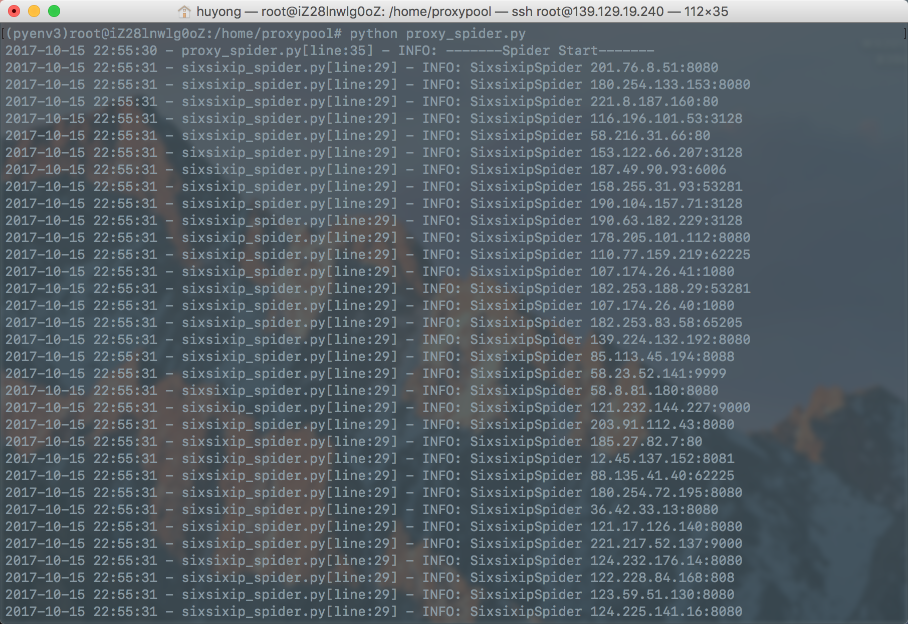
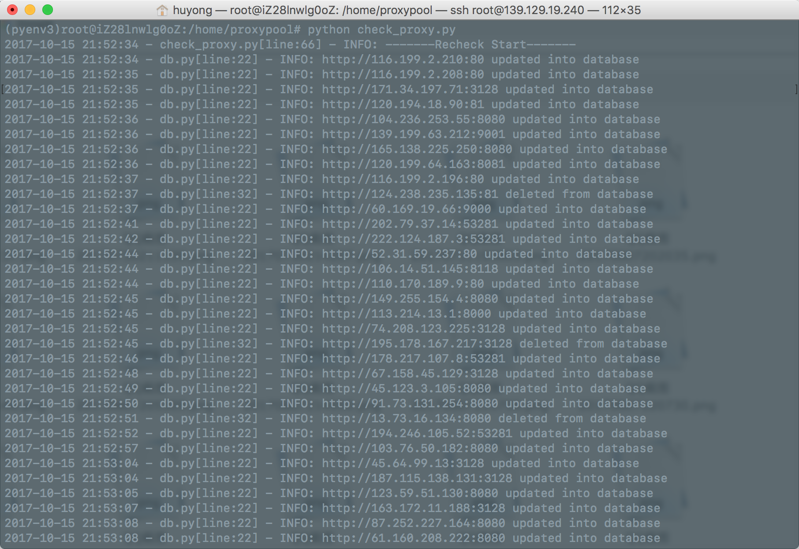

# proxypool
proxypool是一个自动抓取免费代理并检测入库的程序，并提供开放的实时API服务:[proxypool-open-WebAPI](http://proxy.nghuyong.top/)

## 使用
本项目采用python3进行开发，建议使用virtualenv

    # 下载源码
    git clone https://github.com/SimpleBrightMan/proxypool.git
    cd proxypool
    # 安装依赖
    pip install -r requirements.txt
    # 爬虫运行
    python proxy_spider.py
    # 重新验证
    python check_proxy.py
   
如果正常可以出现如下的截图：
- 爬虫运行


- 重新验证




## WebAPI

    # 启动webAPI
    python webAPI.py 8080
此时访问[http://127.0.0.1:8080](http://127.0.0.1:8080)就可以调用WebAPI了.

另外，我在阿里云上部署了这个项目，每隔6小时会定时自动抓取/重新验证一遍代理，开放的API地址为:[proxypool-open-WebAPI](http://proxy.nghuyong.top/)

### API使用说明
URL : [http://127.0.0.1:8080](http://127.0.0.1:8080) or [http://proxy.nghuyong.top](http://proxy.nghuyong.top)

Method : GET

Return : json格式，形如：

    {
        num: 692,
        updatetime: "2017-10-15 22:49:16",
        data: [
            {
                type: "http",
                round_trip_time: 1.38,
                ip_and_port: "181.193.73.18:53281",
                country: "Costa Rica",
                anonymity: "transparent"
            },
            {
                type: "http",
                round_trip_time: 0.52,
                ip_and_port: "113.214.13.1:8000",
                country: "China",
                anonymity: "high_anonymity"
            },
            {
                type: "http",
                round_trip_time: 0.58,
                ip_and_port: "159.82.166.133:8080",
                country: "United States",
                anonymity: "normal_anonymity"
            },
            ...
        ]
    }

返回json参数说明：


| 参数            | 类型            | 说明   |
|:--------------:|:-------------:|:-----:|
| num           | int           | 返回代理IP的总数|
| updatetime    | char          | 最后一次更新时间 |
| data          | list          | 代理IP数据 |
| type          | char          |该代理的类型|
| round_trip_time|double        |针对测试网站使用该代理请求往返时间|
| ip_and_port   | char          |代理的IP和端口|
| country       | char          |代理所在的国家|
| anonymity     | char          |代理的匿名情况:transparent:透明；normal_anonymity:匿名；high_anonymity:高匿|

请求的参数举例说明：
- / : 将返回数据库中的所有代理
- /?country=China :针对国家的条件进行结果过滤
- /?type=http :针对代理类型进行结果过滤
- /?anonymity=normal_anonymity :将返回匿名程度**大于等于**查询条件的代理，其中transparent<normal_anonymity<high_anonymity
- /?num=100 :将按代理的匿名和往返时间排序，返回前100个代理

另外这些查询条件可以组合使用，比如：/?country=China&anonymity=high_anonymity&num=10 将返回中国的10个高匿代理

### 在你的爬虫项目中使用该WebAPI
```python
import requests
# 请求API，并解析json成dictionary
proxy_result = requests.get("http://proxy.nghuyong.top").json()
num = proxy_result['num']
updatetime = proxy_result['updatetime']
proxy_data = proxy_result['data']
# 获取其中一个代理
one_proxy = proxy_data[0]
# 爬虫加上代理
requests.get("http://www.baidu.com",proxies={"http":one_proxy['type']+"://"+one_proxy['ip_and_port']})
```
